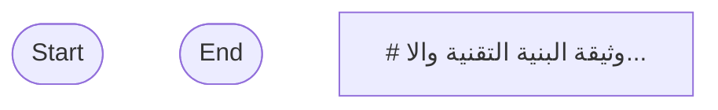

## Workflow Execution Guide

Follow the Mermaid flowchart above to execute the workflow. Each node type has specific execution methods as described below.

### Execution Methods by Node Type

- **Rectangle nodes (Sub-Agent: ...)**: Execute Sub-Agents
- **Diamond nodes (AskUserQuestion:...)**: Use the AskUserQuestion tool to prompt the user and branch based on their response
- **Diamond nodes (Branch/Switch:...)**: Automatically branch based on the results of previous processing (see details section)
- **Rectangle nodes (Prompt nodes)**: Execute the prompts described in the details section below

### Prompt Node Details

#### prompt-1778492428634(# وثيقة البنية التقنية والا...)

```
# وثيقة البنية التقنية والاستراتيجية - منصة "ويكند جو" (Weekend Go)

**التاريخ:** 10 مايو 2026
**إعداد:** م. أيمن مريعي (مهندس معلوماتية، مدير التطوير والحجوزات)

## 1. ملخص المشروع
تهدف هذه الوثيقة إلى تلخيص القرارات التقنية والهندسية التي تم الاتفاق عليها لبناء منصة "ويكند جو" للسياحة والسفر. الهدف هو إنشاء منصة حجز احترافية (OTA) تضاهي "المسافر" و "Booking.com" من حيث الأداء، دقة البيانات، والهوية البصرية الفاخرة (Luxurious).

## 2. التقنيات المعتمدة (Tech Stack)
* **الواجهة الأمامية (Frontend):** إطار عمل Next.js مع Tailwind CSS و Framer Motion لضمان سرعة التحميل (SEO-friendly) وتجربة مستخدم مبهرة.
* **البنية التحتية (Backend):** بيئة Node.js مع قاعدة بيانات PostgreSQL (نظراً لقوتها في العلاقات المعقدة وتوافقها مع الخلفية المحاسبية وأنظمة مثل SAP).
* **محرك البحث:** Elasticsearch لتوفير فلاتر بحث متقدمة وسريعة لآلاف التفاصيل الفندقية.
* **تحسين الأداء:** Redis للتخزين المؤقت (Caching) و Cloudinary لمعالجة الصور وعرضها بأعلى جودة.

## 3. استراتيجية مصادر البيانات (Best-of-Breed)
لمنع تكرار الغرف وتوفير أدق التفاصيل بأفضل سعر، تم اعتماد معمارية الوسيط البرمجي (Middleware) لدمج البيانات من مصادر متعددة:
* **WebBeds (الأسعار والتوفر اللحظي):** المصدر الرئيسي لاستدعاء الأسعار المباشرة عند بحث العميل (Live API Call).
* **Booking.com (التصنيف والبيانات الوصفية):** الهيكل الأساسي لأنواع الغرف، الإطلالات، والمرافق لضمان دقة الوصف وتصنيف الخدمات (Taxonomy).
* **TBO (المحتوى البصري):** سحب الصور والفيديوهات عالية الدقة وتخزينها محلياً عبر مهام مجدولة دورية (Cron Jobs) لضمان سرعة الموقع.
* **عقود مكة الخاصة (قاعدة البيانات المحلية):** بناء (Micro-Extranet) مخصص لإدخال العروض الحصرية للشركة، مع إعطائها أولوية الظهور للعملاء.

## 4. الميزات الاستراتيجية والتسويقية
* **نظام الدمج الذكي (Mapping & De-duplication):** خوارزمية لتوحيد الفنادق والغرف المتشابهة من عدة مزودين (باستخدام GIATA ID أو المطابقة الجغرافية) لتظهر للعميل كخيار واحد نظيف بدون تشتيت.
* **توليد حالات الواتساب (WhatsApp Status Generator):** أداة تسويقية تدمج بيانات الفندق والسعر لإنتاج تصاميم طولية فاخرة بضغطة زر لدعم جهود التسويق الإلكتروني.
* **نظام مراجعات احترافي:** تقييمات تفصيلية (نظافة، موقع، طاقم، راحة) موثقة للحجوزات الفعلية فقط، مع إتاحة الرد الإداري لتعزيز الموثوقية.

## 5. الخطوات القادمة المقترحة
1. تصميم هيكلية قاعدة البيانات (Database Schema) لاستيعاب الدمج الآمن بين المصادر الثلاثة.
2. بناء واجهة لوحة التحكم (Admin Dashboard) الخاصة بإدارة العقود الحصرية.
3. طلب الـ API والتراخيص (API Credentials & Sandbox) من كل من WebBeds و TBO.

```
